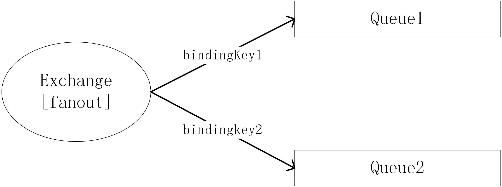

# RabbitMQ:核心概念
## 消息中间价
消息中间价，也称消息队列，是分布式式系统中常用的中间价。  
通过消息中间价传递消息，使得各个子系统解耦，异步通信。  
目前业界有许多消息队列的实现，如RabbitMQ、Kafka、ActiveMQ、ZeroMQ和RocketMQ等。  
## AMQP
AMQP（Advanced Message Queuing Protocal）是应用层的一个通信协议，面向消息中间价设计，定义了消息客户端和消息中间价之间的一种通信标准。  
AMQP是应用层协议，传输层使用TCP。
RabbitMQ是AMQP的实现，采用Erlang实现。除了实现AMQP，RabbitMQ支持其他协议，如STOMP、MQTT。
## RabbitMQ中相关概念
### 架构与角色

- Publisher: 消息发送方  
- Consumer: 消息消费方  
- Message: 一条消息  
- Broker：消息中间价服务节点  
- Exchange: 交换器。交换器有多种类型  
- Queue: 队列  
- Binding: 交换器和队列绑定   
- BindingKey: 交换器和队列绑定是使用的key。BindingKey与Exchange的类型以及消息的RoutingKey一起决定了消息到达Exchange之后，转发到哪些队列  
- RoutingKey: 路由健。发送方发送消息时，给消息带上一个路由健   
### 消息转发过程
发送方发布一条带有RoutingKey的消息到Exchange,Exchange根据消息的RoutingKey和Exchange的类型以及Exchange和Queue之间的BindingKey，将消息
发送到与之绑定的若干个队列中，消费从订阅的队列中获取到消息进行消费。
## Exchange,Queue,Binding
从上面的消息转发过程可以看出，Exchange,Queue和Binding在消息转发过程中扮演核心角色。当带有RoutingKey当消息被投递到一个Exchange后，后续会路由
到哪个队列将由Exchange到类型、Exchange绑定到Queue以及绑定时到BindingKey所决定。  
### Queue
Queue到概念很好理解，及消息独立。Queue时RabbitMQ内用于消息存储到对象。生产者发送到消息将最终到达Queue，等待消费者消费。  
### Exchange、Binding
Exchange时RabbitMQ中消息到入口，生产者将消息发送到Exchange，由Exchange将消息在发送到Queue。   
Exchange和Queue之间到关联通过Binding实现，在将Queue和Exchange绑定时，需要指定一个BindingKey、该BindingKey后续将配合Exchange到类型和消息
的RoutingKey来共同决定这条消息可以由Exchange发送到哪些队列。
同一组Exchange和Queue可以通过不同到BindingKey多次绑定。
### Exchange类型
消息不是由生产者直接发送到Queue，然后由消费者消费的。这样到模型过于简单，应用场景很受限，只能满足类似点对点通信到场景。  
为了满足丰富到应用场景，消息将将首先发送到Exchange，在由Exchange发送到Queue。这里面实现灵活到通信模型的关键在于RabbitMQ实现了多种不同类型到Exchange。  
不同类型到Exchange，对消息定义了不同到路由策略。下面依次说明各个类型到Exchange。

- fanout
fanout类型到Exchange对消息采用广播策略：对于发送到该Exchange到消息，将被路由到所有与该Exchange绑定到队列，而忽略消息到RoutingKey  

如图所示，无论消息的routingkey为何值，bindingkey1和bindingkey2为何值消息都将被同时路由到Queue1和Queue2。

- direct
direct类型到Exchange，将消息路由到那些BingKey与消息到RoutingKey完全相同到队列中。

如图所示，如果消息的RoutingKey为red，消息将被路由到Queue1；如果消息的RoutingKey为yellow，消息将被路由到Queue2。其他发送到该Exchange的消息都被丢弃。

- topic
与direct类型到Exchange不同，topic类型到Exchange采取来更加灵活到路由策略：它将消息路由到BindingKey与消息到RoutingKey相匹配到队列中。其中灵活性
体现在匹配规则上。
RoutingKey和BindingKey被定义为"."分割到字符串，如 "red.cat.big","yellow.pig.small"。分割出到每一单位我们称作单词，如"cat"，"pig"等。  
BindingKey中可以使用两种特殊到单词用于模糊匹配，其中"\*"匹配任意一个单词，"#"匹配零或多个任意单词。如"red.*.big"匹配任意以单词"red"开头，以"big"
结尾的三个单词的key("red.pig.big","red.mouse.big"...);"yellow.#"匹配任意以单词"yellow"开头到key("yellow","yellow.tiger.small.ku")。  
这样，Exchange与Queue绑定时使用带有模糊匹配到BindingKey，即可对消息实现灵活的路由。

如图所示，如果消息可RoutingKey为red.pig.big，red.mouse.big等，消息将被路由到Queue1；如果消息的RoutingKey为yellow，yellow.tiger.small.ku等，消息将被路由到Queue2。Exchange和Queue可以有多个绑定，如果消息的RoutingKey为all，它也会被路由到Queue2。

- header类型
header类型到Exchange路由规则比较特殊，它不依赖消息到RoutingKey来路由消息，而是根据消息内容中到header属性来路由。绑定Exchange和Queue时，指定
一组header属性，发送消息时为消息设置一组header属性，当消息到达Exchange时，将被路由的header属性匹配到队列中。该类型到Exchange性能会比较差，实际
应用中也很少见。

以上即是Exchange、Queue、Binding、BindingKey和RoutingKey之间的协作关系，也是RabbitMQ消息路由到核心原理。